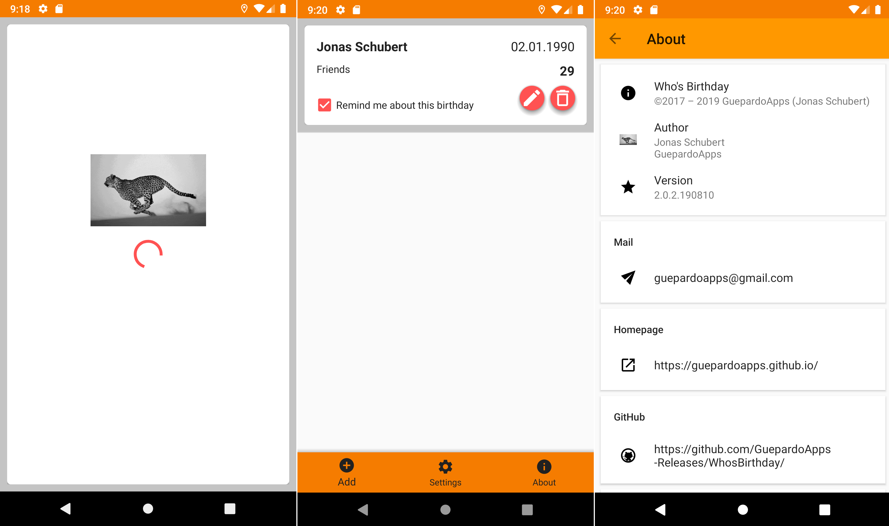
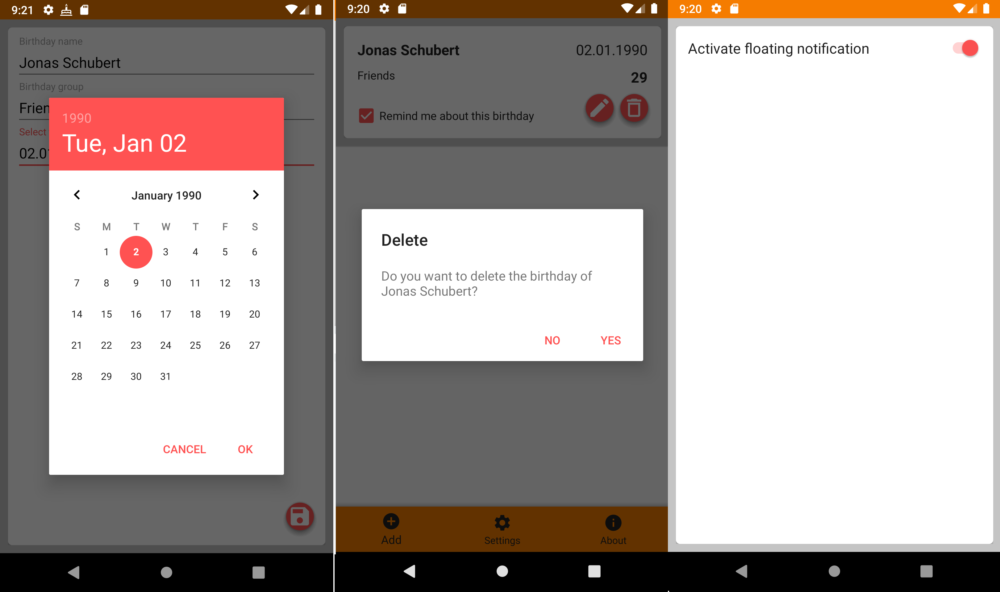

# Who's Birthday - develop branch

Android application for saving birthdays and getting remembered

# Screenshots

___________________________________

## License

Who's Birthday is distributed under the MIT license. [See LICENSE](LICENSE.md) for details.